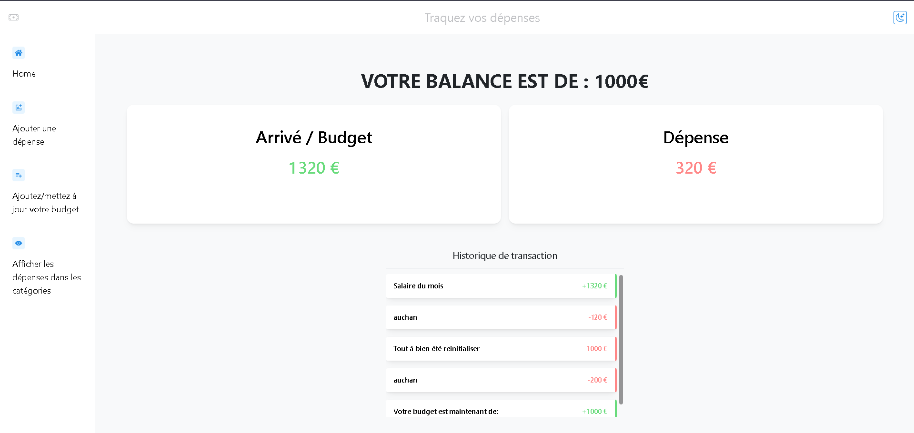
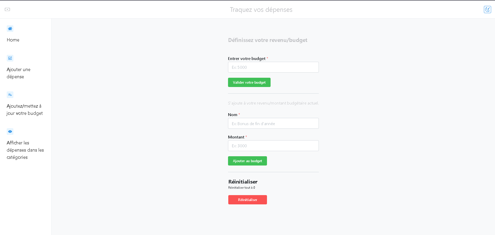
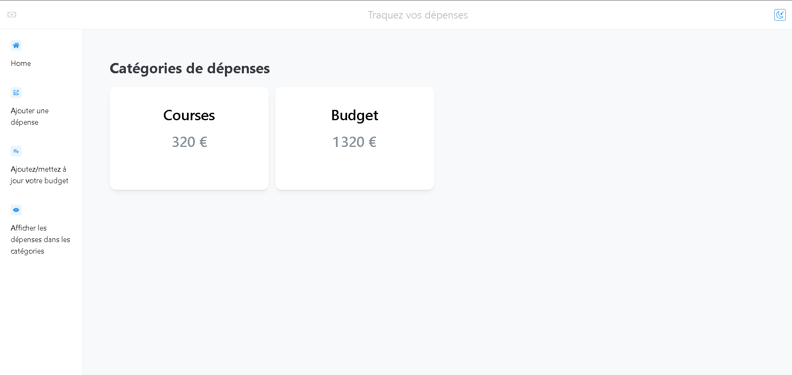

## Core Functionality

### Context Management

The application uses React Context API for state management through three main contexts:

1. **CategoriesContext**

- Manages expense categories
- Handles budget calculations
- Tracks category amounts

2. **HistoryContext**

- Manages transaction history
- Handles transaction creation and deletion
- Maintains chronological order

3. **AvailableCategoriesContext**

- Manages available expense categories
- Handles category creation and deletion
- Tracks category usage

### Budget Operations

The application supports various budget operations:

- Initial budget setting
- Budget additions
- Budget resets
- Real-time balance calculations

### Expense Management

Expenses can be:

- Added with descriptions
- Categorized
- Tracked historically
- Reset entirely
- Deleted individually

## Components

### Key Components

1. **MainAppShell**

- Main application layout
- Navigation management
- Theme switching
- Responsive design

2. **HistoryStack**

- Transaction history display
- Scrollable transaction list
- Transaction filtering

3. **DisplayCard**

- Reusable card component
- Budget and expense display
- Category amount display

4. **AddToExpenses**

- Expense addition form
- Category selection
- Amount validation

### Pages

1. **HomePage**

- Overview of finances
- Current balance
- Recent transactions

2. **AddExpensePage**

- Expense addition interface
- Category management
- Amount input

3. **AddBudgetPage**

- Budget management
- Income addition
- Budget reset options

4. **DisplayCategoriesPage**

- Category overview
- Category-wise expenses
- Category management

## State Management

The application uses React Context API with local storage persistence for state management. This ensures that:

- Data persists across sessions
- State is accessible throughout the application
- Components can access and modify state as needed

## Styling

The application uses Mantine UI for styling with:

- Responsive design principles
- Dark/Light theme support
- Consistent styling across components
- Custom style overrides where needed

## Screenshots

### Home Dashboard

- Main dashboard showing current balance
- Budget and expense overview cards
- Recent transaction history

### Expense Management

- Intuitive expense addition interface
- Category selection dropdown
- Amount input with validation

### Budget Management

- Budget setting interface
- Income addition form
- Budget reset functionality

### Category Overview

- Category-wise expense breakdown
- Visual representation of spending
- Category management tools

### Transaction History

- Detailed transaction log
- Chronological ordering
- Transaction details modal

### Dark/Light Theme

- Toggle between dark and light modes
- Consistent styling across themes
- Enhanced visibility options

> Note: To see these screenshots in action, clone the repository and run the application locally following the installation instructions above.

## Contributing

1. Fork the repository
2. Create a feature branch
3. Commit your changes
4. Push to the branch
5. Create a Pull Request

## License

This project is licensed under the MIT License - see the LICENSE file for details.
